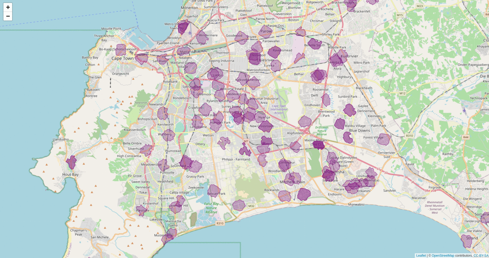

# Accessibility of Cape Town's clinics

The greater city of Cape Town has 140 community health clinics. They are listed on the government website [here](https://www.capetown.gov.za/Family%20and%20home/See-all-City-facilities/Our-service-facilities/Clinics%20and%20healthcare%20facilities). 

- What is the **distribution** of 140 clinics across the city?
- How **accessible** are they to different communities?
- What **areas** are covered to reach a clinic within different walking times?

We can answer these questions with OSRM and R, as shown in this repository. The gif below shows an output that maps the locations of the 140 clinics and then we generate an [isochrone](https://en.wikipedia.org/wiki/Isochrone_map) for each location to show what area is covered by the clinic for different walking times, namely:

- a walking time of 10 min (purple)
- a walking time of 20 min (red)



Especially in our current times with the COVID 19 pandemic, vaccine roll outs as well as continued disruptions, strikes and violence within the public transport system, it is very important to see how accessible our health services and clinics are to the communities across Cape Town.

Analyses like this can not only help to investigate the current situation but also help with future city planning, for example finding the optimal location for a new clinic based on areas that do not have good accessibility at the moment.

## Recording available from afrimapr

I presented this analysis with an explanation and demo of the code at the July 2021 [afrimapr](https://afrimapr.github.io/afrimapr.website/) community meetup. A recording of the tutorial is available [here](https://www.youtube.com/watch?v=f_UoPrsmSQg) on Youtube. We only realised and started the recording a little way in, hence the abrupt start! 

## OSRM setup and processing

You can install OSRM on a Linux environment, as outlined [here](https://datawookie.dev/blog/2017/09/building-a-local-osrm-instance/), or use the Docker image, as shown here and described in more detail [here](https://github.com/Project-OSRM/osrm-backend#using-docker).

1. Pull the OSRM Docker image:

```bash
docker pull osrm/osrm-backend
```

2. Download the map data for the region you are interested in using [Open Street Maps](https://www.openstreetmap.org/export#map=10/-33.9857/19.0800).

3. Pre-process the map extract with the foot profile (as we are interested in walking times)

```bash
docker run -t -v "${PWD}/osrm_data:/data" osrm/osrm-backend osrm-extract -p /opt/foot.lua /data/map.xml
docker run -t -v "${PWD}/osrm_data:/data" osrm/osrm-backend osrm-contract /data/map.xml.osrm
```

4. Start a routing engine HTTP server on port 5000:

```bash
docker run -t -i -p 5000:5000 -v "${PWD}/osrm_data:/data" osrm/osrm-backend osrm-routed /data/map.xml.osrm
```

## {osrm} R package

```bash
# Install package
install.packages('osrm')

# Load library
library(osrm)

# Point to osrm server running locally
options(osrm.server = "http://127.0.0.1:5000/")
```

## Data and scripts

The extracted map OSRM data is very large and is not included in this repository, however, you can still run the scripts using the processed data, namely:

- `01_clinic_data.R` will read in the JSON files obtained from the government website, extract the required data, do the geocoding (you need to register with the Google Maps API and get a key if you want to do this yourself) and save an `.Rda` file in the data folder.
- `02_osrm_mapping.R` connects to a local OSRM server and generates the isochrones, however I have also added this generated data to the repository so you can read this in without setting up a server and look at the leaflet mapping yourself.
